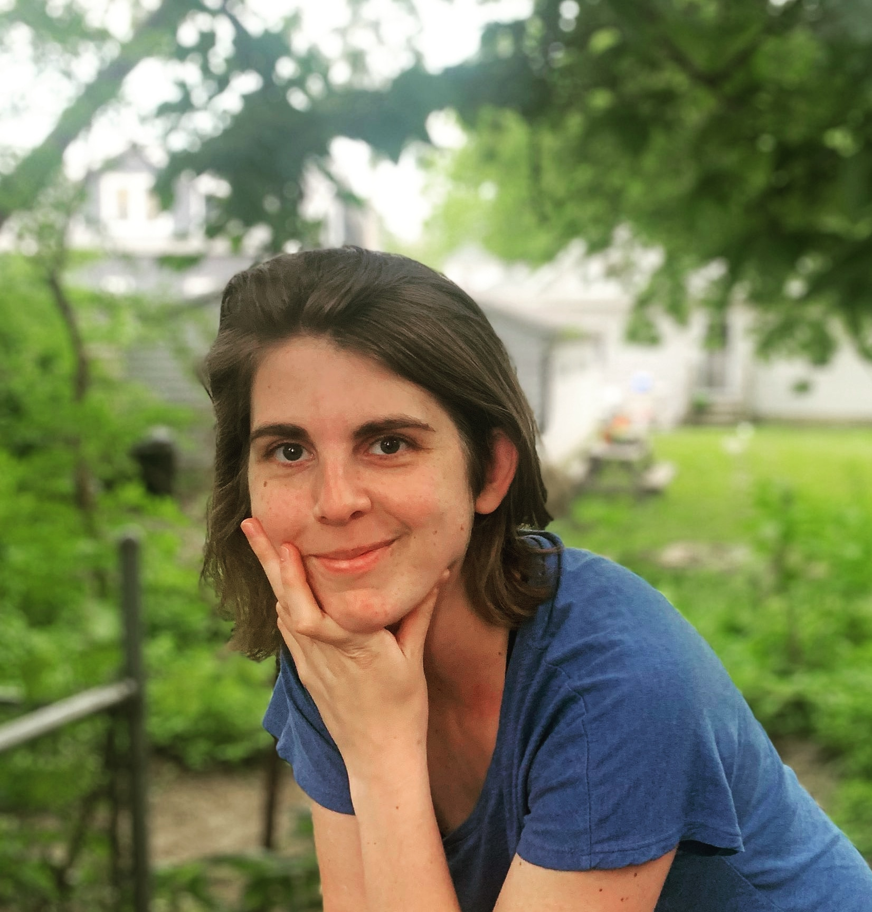

---
title: Home
...

 

I completed my PhD in Computer Science at the University of Illinois at
Urbana-Champaign in Fall 2020 with [Dr. Steven M. LaValle](http://lavalle.pl/). I am now a
Postdoc in Dr. Kirstin Petersen's [Collective Embodied Intelligence Lab](https://cei.ece.cornell.edu/)
 in the Electrical and Computer Engineering Department at Cornell University.
 I have a B.S. in Engineering Physics from the Colorado School of Mines.

**Research Interests:** My thesis was on algorithms and data structures for 
minimal-yet-robust motion and feedback planning for mobile
robots. Specifically, I worked with a broad class of robots that have
structured interactions with their environment, such as Roombas that bump into
walls and furniture or micro-robots that swim blindly until they reach a barrier
or another robot.

My approach involves making coarse characterizations of the geometry and dynamics of 
robot trajectories. By establishing equivalence classes over the
environment and control spaces, we can allow for nondeterminism and uncertainty
at the planning stage and still compute plans that have analytical guarantees on
their stability and long-term dynamical behavior.

Instead of assuming that we have perfect control and observation of a
robot, we use the intrinsic dynamics of the robot to
engineer robust high-level behaviors such as navigating or patrolling a space,
or even object manipulation or self-assembly.

[My CV is here](images/NillesCV.pdf). You can see some of my current projects at
[my github](https://github.com/alexandroid000) and [on my project overview
page](projects.html).

### News

-   **October 2020:** Passed my defense and submitted my thesis!!
-   **February 2020:** Successfully passed my prelim! Thanks to my committee 
    (Steve LaValle, Nancy Amato, Sayan Mitra, and Todd Murphey) for all the feedback.
    Now I am synthesizing their feedback, cleaning up some code, wrapping up projects, 
    and writing my thesis! Hoping to defend around September or October 2020.
    Considering employment opportunities in both academia and industry; please contact me
    if you are interested in working together!
-   **August 2019:** I will be a TA for ECE 470: Introduction to Robotics.
    Excited to work with [Dr. Katie Driggs-Campbell](https://krdc.web.illinois.edu/)
    to revamp this course!
-   **August 2019:** Presented a poster on underactuated self-assembling robots
    at [MRS 2019](https://robotics.cs.rutgers.edu/mrs2019/). Lots of weird and
    interesting projects here, and got some good inspiration for next steps
    toward collective manipulation! Thanks to the organizers, especially for the
    travel grant!
-   **June 2019:** I spent a few weeks in Europe, first at the incredible [summer
    school at the Center for Ubiquitous Computing at University of
    Oulu](http://ubicomp.oulu.fi/ubiss2019/), where I
    learned so much about the design process, and got to get my hands on some
    hardware after a long time spent in theory-land. Then I went to RSS 2019 and presented
    at the workshop on [Robust Task and Motion
    Planning](http://dyalab.mines.edu/2019/rss-workshop/). Thanks to the organizers for
    some illuminating discussions!
-   **March 2019:** Four undergraduates in the Motion Strategy Lab, Justin
    Wasserman, Austin Born, Chris Horn, and John Born were awarded \$1000 from
    the [Leung Student Venture Fund
    Award](https://ece.illinois.edu/academics/ugrad/leung-award.asp) to put
    toward our research project on self-assembling, underactuated robots.
-   **December 2018:** I travelled to beautiful Mérida, Mexico to [WAFR
    2018](https://parasol.tamu.edu/wafr/wafr2018/) to present our paper, *A
    Visibility-Based Approach to Computing Nondeterministic Bouncing
    Strategies*. I travelled there with my undergraduate co-author, Samara Ren,
    and met up with our other co-authors, Steve and Israel Becerra, former MSL
    post-doc. Happy to have seen old and new friends, and to have learned so
    much from them!
