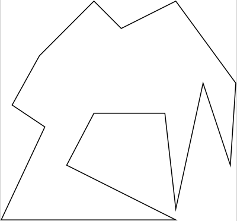
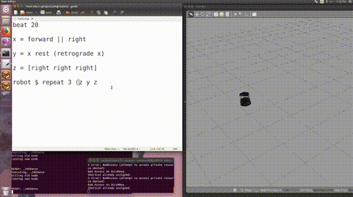
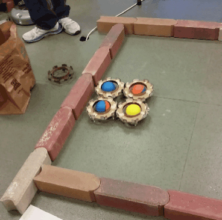

---
title: Old Projects
...

The Dynamics of Bouncing Robots
-------------------------------

{width=6cm class="center"}\

Many robots, such as vacuuming robots, have a default behavior of moving
forward in a straight line until they encounter an obstacle. We call these **bouncing robots**, 
and we can define different "bounce rules" for what the robot should do when it
encounters a boundary. Then, we can analyze the behavior of different bounce
rules in polygonal environments and we are working toward synthesizing
strategies of bounce rules for different tasks such as navigation and
patrolling.

This work has connections to dynamical billiards: to make a bouncing
robot explore a space, you want a bouncing law that covers the polygon well. To
make a bouncing robot localize, you want the robot to become "trapped" in a
small region of phase space (the "attractor"). I have taken an "experimental
mathematics" approach to this work, building a 
[simulator](https://github.com/alexandroid000/bounce) and using it to explore
and verify the dynamical systems analysis.

This project has had papers at [IROS 2017](images/NilBecLav_IROS_17.pdf) and
[WAFR 2018](images/wafr_paper.pdf).

Improv: a High-Level Language for Live-Coding Robot Motion
----------------------------------------------------------

{width=10cm class="center"}\

Started as a project in [Amy LaViers'](http://radlab.mechse.illinois.edu/)
class, I am developing a platform-independent domain-specific language (DSL)
using Haskell. This language uses choregraphic technologies (for example, the
difference between "reversing" a movement sequence and "retrograding") to
improve readability and writeability for prototyping robotic movement.
The user describes movements in a high-level language which is then translated to ROS
messages and sent to a simulator or robot to see the effects of the commands in real
time. The goal is to enable [live coding](https://toplap.org/about/) of robots,
for practical everyday control of such robots as well as performance and
educational applications.

The summary paper of the class project can be found
[here](images/improv_paper_17.pdf), and we had a [paper at
MOCO 2018](images/NilGladMattLaV_18.pdf).

The language is still under development; [code and documentation can be found
here](https://github.com/alexandroid000/improv). Please let us know if you try
it out!

Self-Assembly and Aggregate Robots
-------------

{width=8cm class="center"}\

Our lab has a long history of working with [weaselballs](https://www.youtube.com/watch?v=sDg4frI4rcw), a "model organism-bot" of an
uncontrollable robot.
I am leading a team of undergraduates who are building cases that allow the
weaselballs to connect into assemblies. We are analyzing the
 dynamics of these assemblies experimentally, in the lab and in
simulation. Check out our poster [(high-res version
here)](images/research_fair_Jan_2018.pdf):

{width=16cm class="center"}\

Our long-term goal is to create minimal
information-space based controllers which control the connections between agents
so that the entire assembly acts like a ratchet or motor - converting the
"thermal" energy of the weaselballs into useful linear or rotational motion. We
are also interested in designing environments that control the bulk
thermodynamic properties of the weaselballs, and creating analouges to
"pressure" that would allow objects in the environment to be collectively
manipulated and transported.

There are applications from this work in micro- and nano-robotics, especially
with the exciting new advances in [active
particles](https://journals.aps.org/rmp/abstract/10.1103/RevModPhys.88.045006).

Automated Robot Design
----------------------

I am very interested in using tools from formal methods, such as model checking
and synthesis, to help roboticists explore the space of robot designs. This can
help us in several ways:

-   automate the process of proving bounds on robots' abilities (how do
    different combinations of sensors/actuators affect a robots ability to
    localize, navigate, or do some other task?)
-   make creating new robots easier and more fun, especially for people who are
    not expert roboticists (hobbyists, small businesses, children, etc).
    
This exciting new research area leverages advances from formal methods and from
the fabrication (printable / foldable / modular robots) and design communities.

To this end, I am a contributor to the [robot design
game](http://robot-design.org), an informal (and fun!) way of exploring the
trade-offs between robotic resources and capabilities. I am also helping
organize the [Workshop on Minimality and Trade-offs in Automated Robot
Design](http://minimality.mit.edu) at RSS 2017.

Self-Assembly
-------------

I am
interested in [graph grammars and rewriting based approaches to modelling
assembly](https://github.com/alexandroid000/gg), especially in conjunction with
machine learning and automating rewriting-based strategy generation. This
project has stalled because the question of how to formulate specifications that
are amenable to machine learning and rewriting is Very Hard.

With Yuliy Baryshnikov, I have been working on a simple
model of fetal morphogenesis (how does a developing embryo change from a sphere
to a torus?). I have several simulations environments
[here](https://github.com/alexandroid000/morpho). Yuliy is currently on
sabbatical and thus I am shelving this project for now.

Tracking Motion of Rolling Robots
---------------------------------

[This project](https://github.com/alexandroid000/imu) explores what can be
reconstructed about the motion and environment of a rolling robot with an IMU
fixed to the inside of its spherical surface. Projects like Sphero use IMUs
fixed to an internal platform, whereas we're tracking the rotation of the robot,
essentially creating a "3D wheel encoder".

Documentation on my github includes a general guide to setting up a
small, battery-powered IMU that logs to an SD card.

Results from this project indicated that it is possible to get decent estimates
of the distance and direction traveled by a rolling robot between collisions.

Predicted Information Gain and Exploratory Robots
-------------------------------------------------

"Predicted Information Gain" is an exploratory learning algorithm developed by
the Redwood Center for Computational Neuroscience. While working with [Jim
Crutchfield's group](http://csc.ucdavis.edu/~chaos/) at UC Davis, I adapted this
algorithm for small robots and analyzed their learned representations of the
environment. I also worked on developing ways to include more memory in the
algorithm to adapt to hidden environments. My paper on the project is
[here](images/NillesPIG.pdf). From summer 2014.

Partially Coherent Transport
----------------------------

Recent discoveries have indicated that some photosynthetic structures
are able to use vibrational modes in proteins to encourage semi-coherent
transport of energy. This means that excitons are not collapsed down
into one state, but remain in a superposition of states during
transport, which is a faster and more efficient way to transport energy.
My project involved modelling this process using the Hierarchical
Equations of Motion, a reformulated approximation to the solution of the
Schrodinger Equation. Using these models, my group and myself identified
several physical characteristics for highly coherent systems. This was a
senior design project, and research has been passed on to a new group
and is ongoing. My poster that I presented on my work can be found
[here](images/NillesPoster.pdf), and a more detailed overview that I
wrote with my two research partners is
[here.](images/senior-design-summary.pdf) From academic year 2013-2014.
